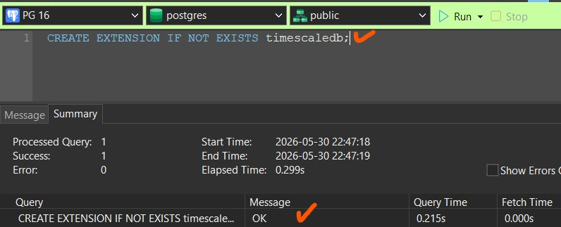

# [**TimescaleDB**](https://github.com/timescale/timescaledb) RE-package
## **TimescaleDB - Time-series database for high-performance real-time analytics packaged as a Postgres extension**
---
## Notes and Installation Guide

I needed **TimescaleDB** for one of my projects while running **Windows 11 (25H2)** with **PostgreSQL v16.1**. Although [Tiger Data](https://www.tigerdata.com/docs/get-started/choose-your-path/install-timescaledb) provides various installation instructions (including Windows), unfortunately the installer could not locate my `pg_config`.

### What I tried
- I attempted to **compile TimescaleDB from the latest source**, but the latest source no longer supports my PostgreSQL version. The build failed with the following error:

```
<your-pgsql-folder>\timescaledb\src\compat\compat.h(63,1): error C1189: #error:  "Unsupported PostgreSQL version" [<your-pgsql-folder>\timescaledb\build\tsl\src\timescaledb-tsl.vcxproj]
```

From this error it is clear that the correct TimescaleDB version for a given PostgreSQL release can be determined by inspecting `src/compat/compat.h` in the TimescaleDB [source](https://github.com/timescale/timescaledb) branches.

### How I resolved it
1. I reviewed the TimescaleDB release packages on GitHub and tested several older releases until I found a package compatible with PostgreSQL v16.1.
2. Once I found a matching release package, I installed the extension using the steps below.

### Installing the TimescaleDB extension on Windows (binary package)
1. Stop the PostgreSQL service via `services.msc`.
2. Download the appropriate TimescaleDB package from the [Releases](https://github.com/andreiramani/timescaledb-windows/releases) page (choose the package that matches your PostgreSQL version).
3. Extract the ZIP file into your PostgreSQL installation directory (overwrite or merge files as required).<br>
   a. `*.dll` files goes to `<your-pgsql-folder>\lib` folder<br>
   b. `*.control` and `*.sql` files goes to `<your-pgsql-folder>\share\extension` folder.<br>
   c. `timescaledb-tune.exe` goes to `<your-pgsql-folder>\bin` folder.<br>
4. From `<your-pgsql-folder>\bin` run `timescaledb-tune.exe -conf-path <your-pgsql-folder>\data -pg-version <major-pgsql-version>` to optimize `postgresql.conf` settings.
   (`postgresql.conf` location is in `<your-pgsql-folder>\data`)
5. Start the PostgreSQL service.
6. Connect to PostgreSQL, from destination DB run:
   ```
   CREATE EXTENSION IF NOT EXISTS timescaledb;
   ```
7. If the command returns `OK`, the TimescaleDB extension is installed successfully.
   
   <br></br>
8. Verify version: `SELECT extname, extversion FROM pg_extension WHERE extname = 'timescaledb';` 

### Troubleshooting
- Choose the correct package: Always download the TimescaleDB package that exactly matches your PostgreSQL version and architecture.
- Common error after CREATE EXTENSION:
  ```
  ERROR:  could not load library "<your-pgsql-folder>/lib/timescaledb-x.xx.x.dll": The specified procedure could not be found.
  ```
  This error indicates the TimescaleDB binary is incompatible with the running PostgreSQL version. The fix is to downgrade or switch to a TimescaleDB release that matches your PostgreSQL version.

### Technical note
- If you attempt to build from the latest source and encounter the Unsupported PostgreSQL version error, inspect `src/compat/compat.h` in the TimescaleDB source to see which PostgreSQL versions are supported by that TimescaleDB commit/release.

### Limitation
- Currently, I have not tested all available TimescaleDB packages. Only the version that I use for my project will be included in the releases.

### Request / Call for help
If you have a TimescaleDB binary package that is compatible with other PostgreSQL versions on Windows, please let me know/drop info on [`Discussion`](https://github.com/andreiramani/timescaledb-windows/discussions). I am especially interested in packages for PostgreSQL versions commonly used on Windows machines.

### Summary
The official Windows instructions may fail for some local setups. When building from source, check `src/compat/compat.h` for supported PostgreSQL versions. For most users on Windows, the quickest path is to find a prebuilt TimescaleDB release that matches your PostgreSQL version.

<!--
***
[](https://www.star-history.com/?repos=andreiramani%2Ftimescaledb_pgsql_windows&type=timeline&legend=top-left)
-->
